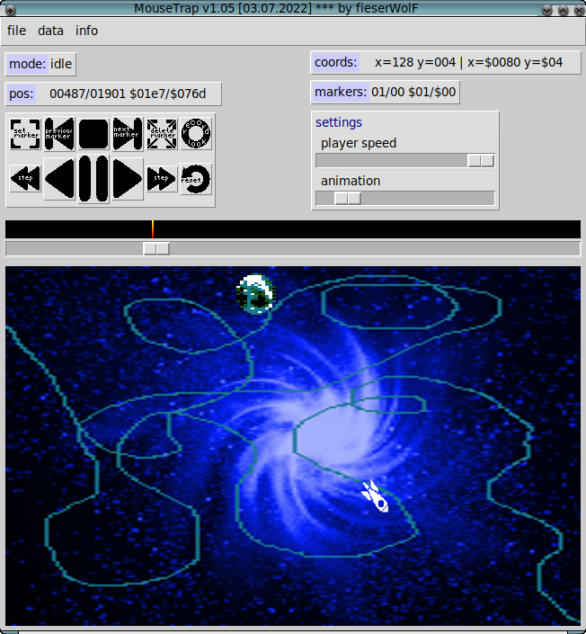

# MouseTrap

MouseTrap records mouse movements and writes them to binary data files.
It runs on 64 bit versions of Linux, MacOS, Windows and other systems supported by Python. 



# Why MouseTrap?

reason | description
---|---
open source | easy to modify and to improve, any useful contribution is highly welcome
portable | available on Linux, MacOS, Windows and any other system supported by Python3
easy to use | simple GUI provided


# Usage

    MouseTrap v1.03 [17.01.2022] *** by fieserWolF
    usage: mousetrap.py [-h] [-i IMAGE_FILE] [-p POINTER_FILE] [-g GHOST_FILE] [-xl POSX_LO_FILE] [-xh POSX_HI_FILE] [-y POSY_FILE] [-ml MARKER_LO_FILE]
                        [-mh MARKER_HI_FILE]

    This records mouse movements and writes them to binary data files. Press F1 for help in the program.

    optional arguments:
      -h, --help            show this help message and exit
      -i IMAGE_FILE, --image_file IMAGE_FILE
                            image file (320x200 pixel)
      -p POINTER_FILE, --pointer_file POINTER_FILE
                            optional pointer image file (44x46 pixel): it follows the mousepointer
      -g GHOST_FILE, --ghost_file GHOST_FILE
                            optional ghost pointer image file (44x46 pixel): it follows the recorded data
      -xl POSX_LO_FILE, --posx_lo_file POSX_LO_FILE
                            posx low file (default="posx_lo.bin")
      -xh POSX_HI_FILE, --posx_hi_file POSX_HI_FILE
                            posx high file (default="posx_hi.bin")
      -y POSY_FILE, --posy_file POSY_FILE
                            posy file (default="posy.bin")
      -ml MARKER_LO_FILE, --marker_lo_file MARKER_LO_FILE
                            marker file (default="marker_lo.bin")
      -mh MARKER_HI_FILE, --marker_hi_file MARKER_HI_FILE
                            marker file (default="marker_hi.bin")

    Example: ./mousetrap.py -i image.png -p ball.png -g ghost.png -xl posx-low.bin -xh posx-high.bin -y posy.bin -ml marker_lo.bin -mh marker_hi.bin


# Author

* fieserWolF/Abyss-Connection - *code* - [https://github.com/fieserWolF](https://github.com/fieserWolF) [https://csdb.dk/scener/?id=3623](https://csdb.dk/scener/?id=3623)


# Getting Started

Clone the git-repository to your computer:

    git clone https://github.com/fieserWolF/mousetrap.git

Start the python script:
    python3 mousetrap.py -i image.png -p ball.png -g ghost.png -xl posx-low.bin -xh posx-high.bin -y posy.bin -ml marker_lo.bin -mh marker_hi.bin

Or: Start the sample bash file:
    ./go.sh

### Prerequisites

At least this is needed to run the script directly:

- python 3
- python tkinter module
- python "The Python Imaging Library" (PIL)

Normally, you would use pip like this:
```
pip3 install tk pillow
```

On my Debian GNU/Linux machine I use apt-get to install everything needed:
```
apt-get update
apt-get install python3 python3-tk python3-pil python3-pil.imagetk
```
# Changelog

## Future plans

- improve GUI features

Any help and support in any form is highly appreciated.

If you have a feature request, a bug report or if you want to offer help, please, contact me:

[http://csdb.dk/scener/?id=3623](http://csdb.dk/scener/?id=3623)
or
[wolf@abyss-connection.de](wolf@abyss-connection.de)


## Changes in 1.03

- initial public release

# License

_MouseTrap records mouse movements and writes them to binary data files._

_Copyright (C) 2022 fieserWolF / Abyss-Connection_

This program is free software: you can redistribute it and/or modify it under the terms of the GNU General Public License as published by the Free Software Foundation, either version 3 of the License, or (at your option) any later version.

This program is distributed in the hope that it will be useful, but WITHOUT ANY WARRANTY;
without even the implied warranty of MERCHANTABILITY or FITNESS FOR A PARTICULAR PURPOSE.
See the GNU General Public License for more details.

You should have received a copy of the GNU General Public License along with this program.
If not, see [http://www.gnu.org/licenses/](http://www.gnu.org/licenses/).

See the [LICENSE](LICENSE) file for details.

For further questions, please contact me at
[http://csdb.dk/scener/?id=3623](http://csdb.dk/scener/?id=3623)
or
[wolf@abyss-connection.de](wolf@abyss-connection.de)

For Python3 and other used source licenses see file [LICENSE_OTHERS](LICENSE_OTHERS).


