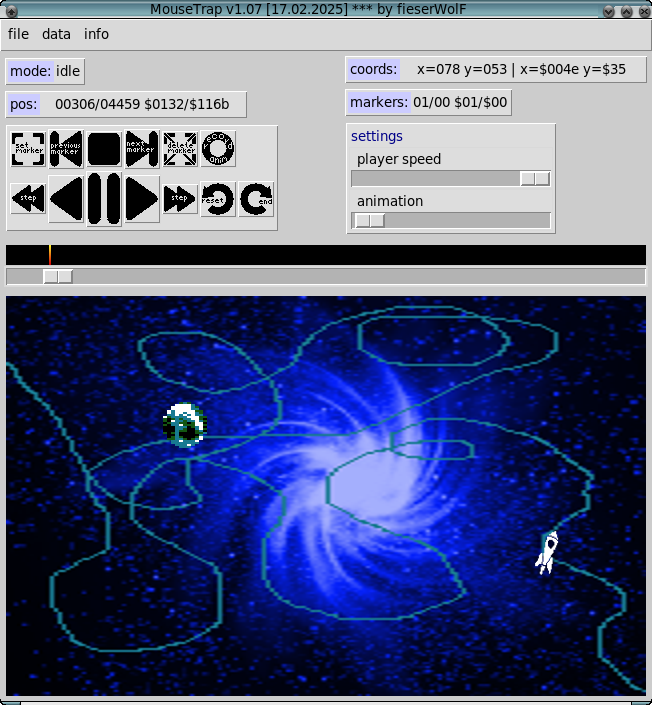

# MouseTrap

MouseTrap records mouse movements and writes them to binary data files.
It is aimed towards development on the Commodore 64.
This is why the screen dimensions default to 320x200.

MouseTrap runs on 64 bit versions of Linux, MacOS, Windows and other systems supported by Python. 



This tool might be helpful for code projects that need some x-y positions stored as plain binary data.
You can easily move your mouse pointer over some background-image that serves as a preview of the final result.
A simple player and a timeline is also provided for easy editing.
You can play forwards and backwards at different speeds, or you can preview your movements step-by-step.
When satisfied with your movements you may add markers at certain positions in the timeline.
These markers can be used later on in your code then.
Also, you can add animation steps to your object while playing the pre-recorded x-y positions.


# Why MouseTrap?

reason | description
---|---
open source | easy to modify and to improve, any useful contribution is highly welcome
portable | available on Linux, MacOS, Windows and any other system supported by Python3
easy to use | simple GUI provided


# Files

file|description
---|---
ball.png|(sprite)pointer image
ghost.png|(sprite)pointer image of previously-recorded data
image.png|background-image
rocket-image.png|background-image for rocket animation
rocket.webp|rocket animation, 16 layers
marker_hi.bin|marker binary high (values above 255)
marker_lo.bin|marker binary low (values 0 to 255)
posx_hi.bin|x-position binary high (values above 255)
posx_lo.bin|x-position binary low (values 0 to 255)
posy.bin|y-position (values 0 to 255)
look.bin|look of sprite, animation steps (values 0 to 255)


# Commandline options

    MouseTrap v1.05 [03.07.2022] *** by fieserWolF
    usage: mousetrap.py [-h] [-a ANIM_FILE] [-b BACKGROUND_FILE] [-p POINTER_FILE] [-g GHOST_FILE] [-xl POSX_LO_FILE] [-xh POSX_HI_FILE] [-y POSY_FILE]
                        [-l LOOK_FILE] [-ml MARKER_LO_FILE] [-mh MARKER_HI_FILE]

    This records mouse movements and writes them to binary data files. Press F1 for help in the program.

    options:
      -h, --help            show this help message and exit
      -a ANIM_FILE, --anim_file ANIM_FILE
                            animation pointer image file
      -b BACKGROUND_FILE, --background_file BACKGROUND_FILE
                            background image file (320x200 pixel)
      -p POINTER_FILE, --pointer_file POINTER_FILE
                            optional pointer image file (44x46 pixel): it follows the mousepointer
      -g GHOST_FILE, --ghost_file GHOST_FILE
                            optional ghost pointer image file (44x46 pixel): it follows the recorded data
      -xl POSX_LO_FILE, --posx_lo_file POSX_LO_FILE
                            posx low file (default="posx_lo.bin")
      -xh POSX_HI_FILE, --posx_hi_file POSX_HI_FILE
                            posx high file (default="posx_hi.bin")
      -y POSY_FILE, --posy_file POSY_FILE
                            posy file (default="posy.bin")
      -l LOOK_FILE, --look_file LOOK_FILE
                            look-datafile: which sprite is used for each position (default="look.bin")
      -ml MARKER_LO_FILE, --marker_lo_file MARKER_LO_FILE
                            marker file (default="marker_lo.bin")
      -mh MARKER_HI_FILE, --marker_hi_file MARKER_HI_FILE
                            marker file (default="marker_hi.bin")

    Example: ./mousetrap.py -b image.png -p ball.png -a rocket.webp -g ghost.png -xl posx-low.bin -xh posx-high.bin -y posy.bin -l look.bin -ml marker_lo.bin -mh marker_hi.bin


# Controls

## main control

control|function
---|---
left-mousebutton|start/stop recording
F1|show help
Alt+q|quit
Alt+i|open image
Alt+p|open pointer-image
Alt+g|open ghost-image
Alt+g|open animation-image
Alt+s|save data
Alt+r|reload data


## player controls

control|function
---|---
r|reset
f|play forward
space|stop
b|play backward
n|play next step
v|play previous step

## marker controls

control|function
---|---
m|set marker
n|jump to next marker
p|jump to previous marker
g|go to current marker


# Author

* fieserWolF/Abyss-Connection - *code* - [https://github.com/fieserWolF](https://github.com/fieserWolF) [https://csdb.dk/scener/?id=3623](https://csdb.dk/scener/?id=3623)


# Getting Started

Clone the git-repository to your computer:
```
git clone https://github.com/fieserWolF/mousetrap.git
```

Start the python script:
```
python3 mousetrap.py -i image.png -p ball.png -g ghost.png -xl posx-low.bin -xh posx-high.bin -y posy.bin -ml marker_lo.bin -mh marker_hi.bin
```

Or: Start the sample bash file:
```
./go.sh
```

### Prerequisites

At least this is needed to run the script directly:

- python 3
- argparse
- python tkinter module
- python "The Python Imaging Library" (PIL)

Normally, you would use pip like this:
```
pip3 install argparse tk pillow
```

On my Debian GNU/Linux machine I use apt-get to install everything needed:
```
apt-get update
apt-get install python3 python3-tk python3-pil python3-pil.imagetk python3-argh
```
# Changelog

## Future plans

- improve GUI features

Any help and support in any form is highly appreciated.

If you have a feature request, a bug report or if you want to offer help, please, contact me:

[http://csdb.dk/scener/?id=3623](http://csdb.dk/scener/?id=3623)
or
[wolf@abyss-connection.de](wolf@abyss-connection.de)


## Changes in 1.05

- added support for animations


## Changes in 1.04

- bug-fixes and improvements


## Changes in 1.03

- initial public release

# License

_MouseTrap records mouse movements and writes them to binary data files._

_Copyright (C) 2022 fieserWolF / Abyss-Connection_

This program is free software: you can redistribute it and/or modify it under the terms of the GNU General Public License as published by the Free Software Foundation, either version 3 of the License, or (at your option) any later version.

This program is distributed in the hope that it will be useful, but WITHOUT ANY WARRANTY;
without even the implied warranty of MERCHANTABILITY or FITNESS FOR A PARTICULAR PURPOSE.
See the GNU General Public License for more details.

You should have received a copy of the GNU General Public License along with this program.
If not, see [http://www.gnu.org/licenses/](http://www.gnu.org/licenses/).

See the [LICENSE](LICENSE) file for details.

For further questions, please contact me at
[http://csdb.dk/scener/?id=3623](http://csdb.dk/scener/?id=3623)
or
[wolf@abyss-connection.de](wolf@abyss-connection.de)

For Python3 and other used source licenses see file [LICENSE_OTHERS](LICENSE_OTHERS).


